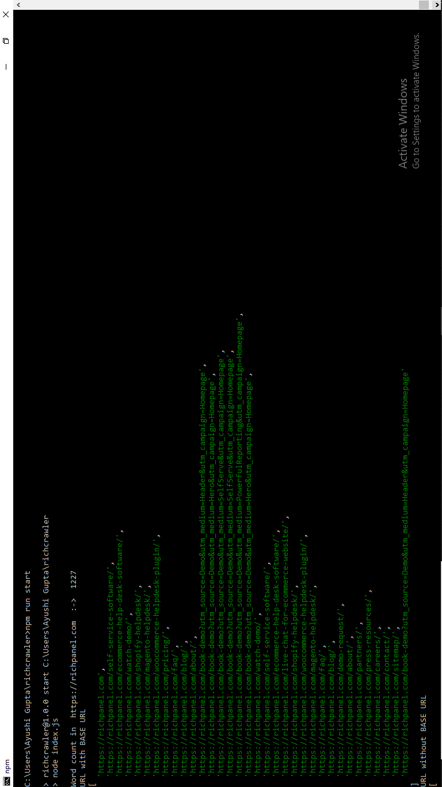
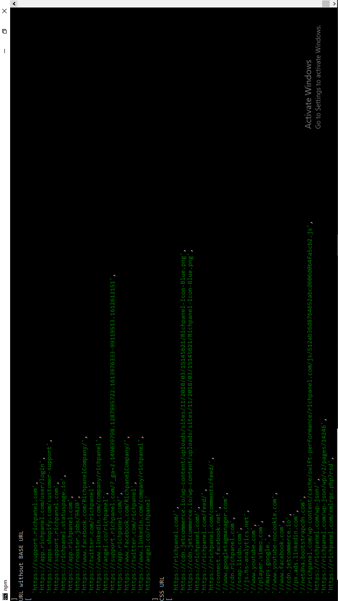
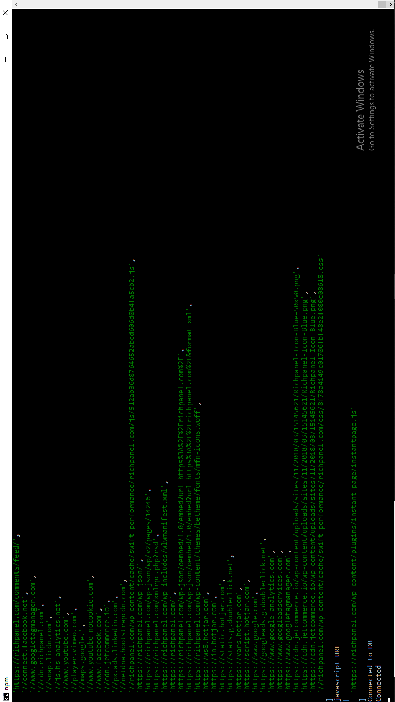

  

  

Program for data scraping from web pages. This program will allow users to map hierarchy of a website, fetch basic information of each page and store it in db.

<h1 align="center">
  
</h1>

## Key Features

* Crawl multiple URL in parallel
* Create entities CLIENT, PAGES and COMPANY
* WORD COUNT ON EACH PAGE

## Technologies and Third party libraries

A few things to note in the project:
* **[Node.js]()** - Node.js® is a JavaScript runtime built on Chrome's V8 JavaScript engine. 
* **[Cheerio]()** - Webscraping library
* Docker - Docker script to start service in production mode.
* **[Express]()** - Express.js, or simply Express, is a back end web application framework for Node.js, released as free and open-source software under the MIT License.
* **[Mongo Database](#)** - MongoDB is a source-available cross-platform document-oriented database program. Classified as a NoSQL database program, MongoDB uses JSON-like documents with optional schemas. 

## Code Pics

  
  
  

## Reference

Refer these documents for development
○	https://developers.facebook.com/docs/messenger-platform/
○	https://developers.facebook.com/docs/pages/
○	https://developers.facebook.com/docs/facebook-login/ 

## Question?

Mail me at abhinav3006gupta@gmail.com

## Contributors

<table>
  <tr>
    <td align="center"><a href="https://kentcdodds.com"> <b>Abhinav Gupta</b></a> 🔍 🚇 🔊</td>
      </tr>
</table>
